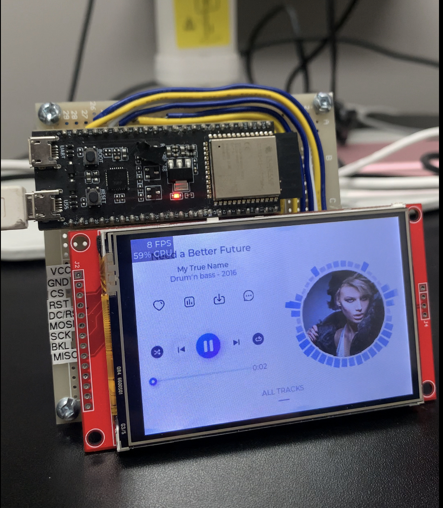
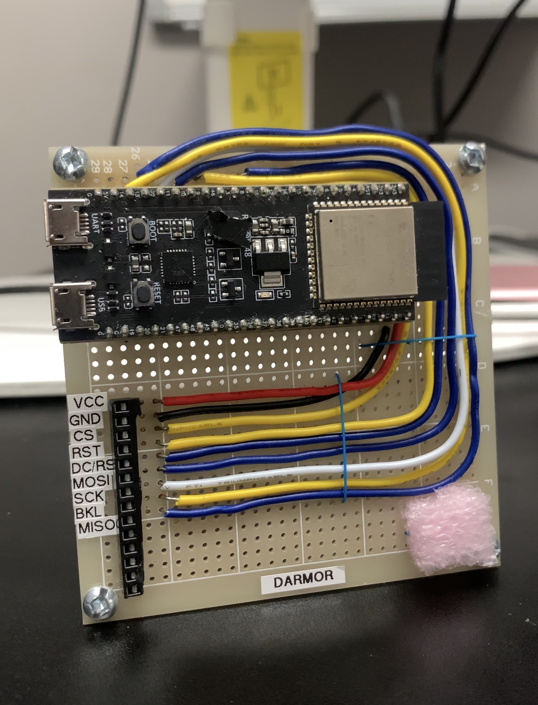

[![Contributors][contributors-shield]][contributors-url]
[![Forks][forks-shield]][forks-url]
[![Stargazers][stars-shield]][stars-url]
[![Issues][issues-shield]][issues-url]
[![MIT License][license-shield]][license-url]
[![LinkedIn][linkedin-shield]][linkedin-url]

<!-- PROJECT LOGO -->
 

  
<h3 align="center">Spotify Dock</h3>

  

    This project combines the use of an embedded ESP32s3 system, graphics library(LVGL) and the Spotify API to allow a user to interface with their Spotify playback controls.
     
     
    <a href="https://github.com/DarmorGamz/Spotify-Dock">View Demo</a>
    ·
    <a href="https://github.com/DarmorGamz/Spotify-Dock/issues">Report Bug</a>
    ·
    <a href="https://github.com/DarmorGamz/Spotify-Dock/issues">Request Feature</a>
  

## Built With
[![C][C.com]][C-url] [![Espressif]][Espressif-url] [![Linux.com]][Linux-url] 

<!-- ABOUT THE PROJECT -->
## About The Project

<!-- LICENSE -->
## License
Distributed under the GPL License. See `LICENSE.txt` for more information.

(<a href="#readme-top">back to top</a>)

<!-- CONTACT -->
## Contact
Darren Morrison - darren09@live.ca   
Project Link: [https://github.com/DarmorGamz/Spotify-Dock](https://github.com/DarmorGamz/Spotify-Dock)

(<a href="#readme-top">back to top</a>)

<!-- ACKNOWLEDGMENTS -->
## Acknowledgments
Myself

(<a href="#readme-top">back to top</a>)

<!-- MARKDOWN LINKS & IMAGES -->
[contributors-shield]: https://img.shields.io/github/contributors/DarmorGamz/Spotify-Dock.svg?style=for-the-badge
[contributors-url]: https://github.com/DarmorGamz/Spotify-Dock/graphs/contributors
[forks-shield]: https://img.shields.io/github/forks/DarmorGamz/Spotify-Dock.svg?style=for-the-badge
[forks-url]: https://github.com/DarmorGamz/Spotify-Dock/network/members
[stars-shield]: https://img.shields.io/github/stars/DarmorGamz/Spotify-Dock.svg?style=for-the-badge
[stars-url]: https://github.com/DarmorGamz/Spotify-Dock/stargazers
[issues-shield]: https://img.shields.io/github/issues/DarmorGamz/Spotify-Dock.svg?style=for-the-badge
[issues-url]: https://github.com/DarmorGamz/Spotify-Dock/issues
[license-shield]: https://img.shields.io/github/license/DarmorGamz/Spotify-Dock.svg?style=for-the-badge
[license-url]: https://github.com/DarmorGamz/Spotify-Dock/blob/master/LICENSE.txt
[linkedin-shield]: https://img.shields.io/badge/-LinkedIn-black.svg?style=for-the-badge&logo=linkedin&colorB=555
[linkedin-url]: https://linkedin.com/in/darren--morrison
[product-screenshot]: images/screenshot.png

[C.com]: https://img.shields.io/badge/c-%2300599C.svg?style=for-the-badge&logo=c&logoColor=white
[C-url]: https://www.cprogramming.com
[Linux.com]: https://img.shields.io/badge/Linux-FCC624?style=for-the-badge&logo=linux&logoColor=black
[Linux-url]: https://aws.amazon.com/amazon-linux-2/
[Espressif]: https://img.shields.io/badge/espressif-E7352C.svg?style=for-the-badge&logo=espressif&logoColor=white
[Espressif-url]: https://docs.espressif.com/projects/esp-idf/en/latest/esp32/get-started/